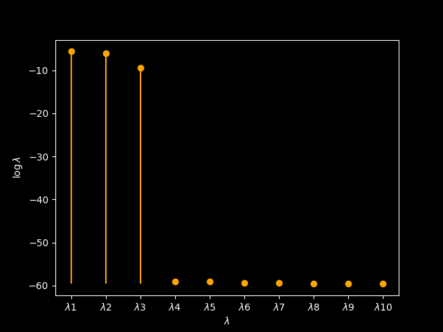
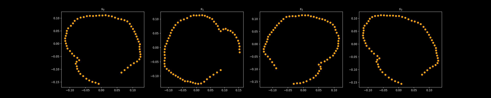
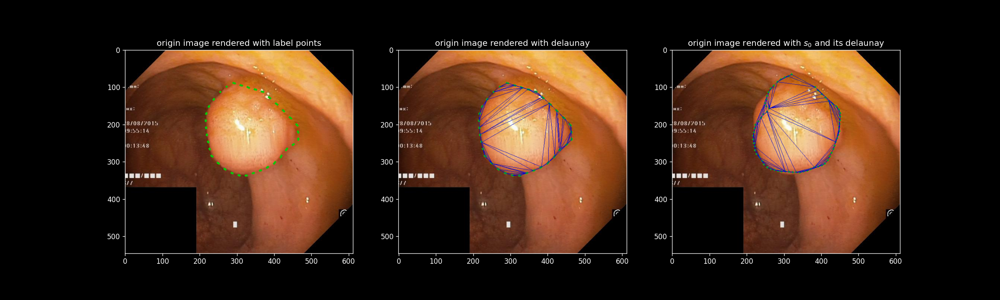
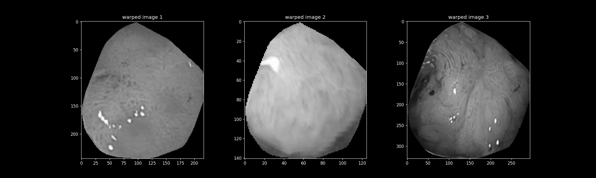
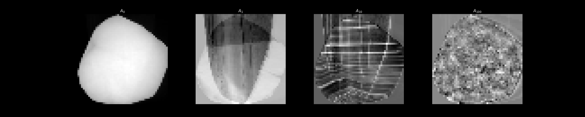
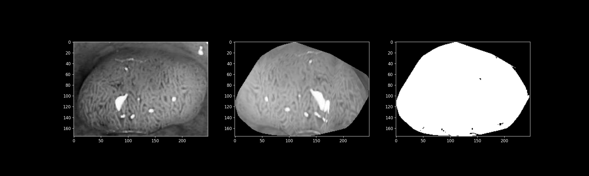

## 🏷️ Introduction

A simple demo to implement AAM (Active Appearance Models), Welcome to visit my [personal website](https://kirigaya.cn/blog/article?seq=143) ( If you can read Chinese characters :D ) for a detailed description for this classical interactive image segmentation algorithm.

> 📌 The repo is a tutorial more than a just-open-to-use project. You can dive into the detail of AAM through my jupyter notebook instance.

## ⚙️ Installation

Enter following command and prepare a cup of black tea or Latte.

```python
$ pip install numpy matplotlib opencv-python pillow scikit-image scipy
```

Then click `kvasir_aam.ipynb` and run the cells one by one.

Consider the situation that some kids may don't wann download the datasets, I have prepared a processed datasets in `aam_datasets`, so just ignore `make_datasets.ipynb`, this is just a backup for myself.

---

## 🎯 Screenshot

### shape modeling

<div align=center>

</div>

<div align=center>

</div>

<div align=center>

</div>


### appearance modeling

<div align=center>

</div>

<div align=center>

</div>

### predict

<div align=center>

</div>

---

## TODO

- [x] Lucas-Kanada Optimise
- [x] Interative App (By Streamlit)  